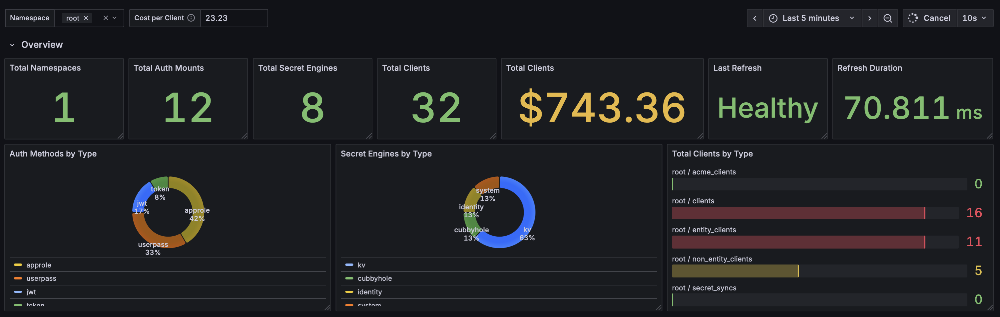
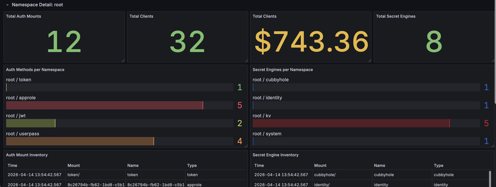

# Vault Usage Exporter
A dead-simple Prometheus Exporter to track the adoption and usage of Vault broken down for each namespace over time

It currently fetches (for every found namespace):

- enabled secret engines
- enabled auth methods
- active tokens
- number of leases




## Available Metrics
- `vault_usage_auth_method{name="<name>",namespace="<namespace>",path="<path>",type="<type>"}`; Gauge
- `vault_usage_exporter_version{version="<version"}`; Gauge
- `vault_usage_leases{namespace="<namespace>"}`; Gauge
- `vault_usage_namespace{name="<name>"}`' Gauge
- `vault_usage_secret_engine{name="<name>",namespace="<namespace>",path="<path>/",type="<type>"}`' Gauge

## Installation
The `vault-usage-exporter` publishes binaries (see https://github.com/clear-route/vault-usage-exporter/releases) and [Docker images for `arm64` and `amd64`](https://github.com/orgs/clear-route/packages?repo_name=vault-usage-exporter).

## Configuration
All of [Vaults Environment Variables](https://developer.hashicorp.com/vault/docs/commands) are supported. You will at least need to provide `VAULT_ADDR` & `VAULT_TOKEN`

## Usage
```bash
> vault-usage-exporter -h
  -address string
        address for metrics HTTP server (default "0.0.0.0")
  -port string
        address for metrics HTTP server (default "9090")
```

You will need to provide a token with at leas the following capabilities:

```hcl
path "sys/namespaces" {
  capabilities = ["list"]
}

path "sys/auth" {
  capabilities = ["read"]
}

path "sys/mounts" {
  capabilities = ["read"]
}

path "sys/leases/lookup/*" {
  capabilities = ["list"]
}

path "auth/token/accessors" {
  capabilities = ["list"]
}
```

## Demo
Checkout [./docker/docker-compose.yml](./docker/docker-compose.yml) to find a prepared Demo Env with Prometheus, Grafana, Vault and the `vault-usage-exporter` automatically set up:

```bash
> cd docker
> docker compose up
```

You should find Vault on [http://localhost:8200](http://localhost:8200), Grafana on [http://localhost:3000](http://localhost:3000), Prometheus on [http://localhost:9090](http://localhost:9090) and the `vault-usage-exporter` running on [http://localhost:8090](http://localhost:8090)

You can then use the [vault-benchmark](https://github.com/hashicorp/vault-benchmark) tool to generate some load (run `make vault-load-gen`) and see some data

You can find the sample dashboard in [assets/dashboard.json](./assets/dashboard.json).