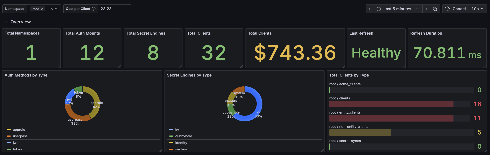
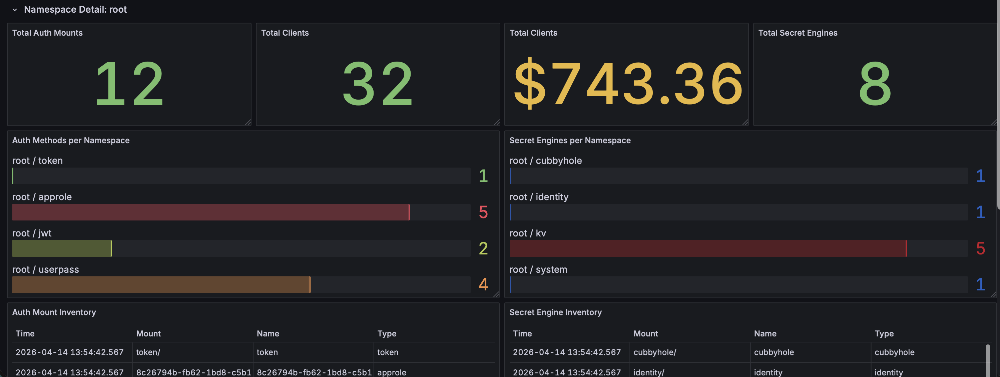

# Vault Usage Exporter
A dead-simple Prometheus exporter to track Vault topology and current-month client usage broken down by namespace and mount over time.

It periodically refreshes data from Vault, caches the last successful snapshot in memory, and serves cached Prometheus metrics on scrape. The refresh currently collects:

- current-month client counts from `sys/internal/counters/activity/monthly`
- enabled secret engines
- enabled auth methods
- namespaces




## Available Metrics
The exporter only exposes `vault_usage_*` series.

Topology:
- `vault_usage_namespaces{name="<name>"}`; Gauge set to `1` for each discovered namespace
- `vault_usage_auth_method{name="<name>",namespace="<namespace>",path="<path>",type="<type>"}`; Gauge set to `1` for each enabled auth mount
- `vault_usage_secret_engine{name="<name>",namespace="<namespace>",path="<path>",type="<type>"}`; Gauge set to `1` for each enabled secrets engine mount

Monthly activity:
- `vault_usage_namespace_clients{namespace="<namespace>",namespace_id="<namespace_id>",namespace_path="<namespace_path>",client_type="<client_type>"}`; Gauge of current-month client counts attributed to a namespace
- `vault_usage_mount_clients{namespace="<namespace>",namespace_id="<namespace_id>",namespace_path="<namespace_path>",mount_path="<mount_path>",mount_type="<mount_type>",client_type="<client_type>"}`; Gauge of current-month client counts attributed to a mount

Exporter health:
- `vault_usage_exporter_version{version="<version>"}`; Gauge set to `1`
- `vault_usage_refresh_success`; Gauge set to `1` when the last refresh succeeded, otherwise `0`
- `vault_usage_refresh_timestamp_seconds`; Gauge of the Unix timestamp for the last refresh attempt
- `vault_usage_refresh_duration_seconds`; Gauge of the last refresh duration in seconds

`client_type` is one of `clients`, `entity_clients`, `non_entity_clients`, `secret_syncs`, or `acme_clients`.

## Installation
The `vault-usage-exporter` [publishes binaries/executables](https://github.com/clear-route/vault-usage-exporter/releases) and [Docker images for `arm64` and `amd64`](https://github.com/orgs/clear-route/packages?repo_name=vault-usage-exporter).

## Configuration
All of [Vaults Environment Variables](https://developer.hashicorp.com/vault/docs/commands) are supported. You will at least need to provide `VAULT_ADDR` & `VAULT_TOKEN`

## Usage
```bash
> vault-usage-exporter -h
  -address string
        address for metrics HTTP server (default "0.0.0.0")
  -port string
        address for metrics HTTP server (default "9090")
  -refresh-interval duration
        interval between Vault refreshes (default 5m0s)
  -timeout duration
        timeout for each Vault refresh request (default 5s)
```

You will need to provide a token with at least the following capabilities to collect topology and monthly activity metrics:

```hcl
path "sys/namespaces" {
  capabilities = ["list"]
}

path "sys/auth" {
  capabilities = ["read"]
}

path "sys/mounts" {
  capabilities = ["read"]
}

path "sys/internal/counters/activity/monthly" {
  capabilities = ["read"]
}
```

These permissions are sufficient for:
- `vault_usage_namespaces`
- `vault_usage_auth_method`
- `vault_usage_secret_engine`
- `vault_usage_namespace_clients`
- `vault_usage_mount_clients`
- the exporter health metrics

## Demo
Checkout [./docker/docker-compose.yml](./docker/docker-compose.yml) to find a prepared Demo Env with Prometheus, Grafana, Vault and the `vault-usage-exporter` automatically set up:

```bash
> cd docker
> docker compose up
```

You should find Vault on [http://localhost:8200](http://localhost:8200), Grafana on [http://localhost:3000](http://localhost:3000), Prometheus on [http://localhost:9090](http://localhost:9090) and the `vault-usage-exporter` running on [http://localhost:8090](http://localhost:8090)

`make docker` only starts the demo stack. The monthly usage metrics `vault_usage_namespace_clients` and `vault_usage_mount_clients` stay absent until Vault has observed some client activity and `sys/internal/counters/activity/monthly` returns non-empty `by_namespace` data.

You can then use the [vault-benchmark](https://github.com/hashicorp/vault-benchmark) tool to generate some load (run `make vault-load-gen`) and see some data

You can find the sample dashboard in [assets/dashboard.json](./assets/dashboard.json).
