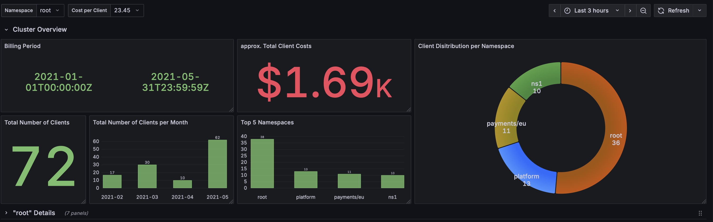
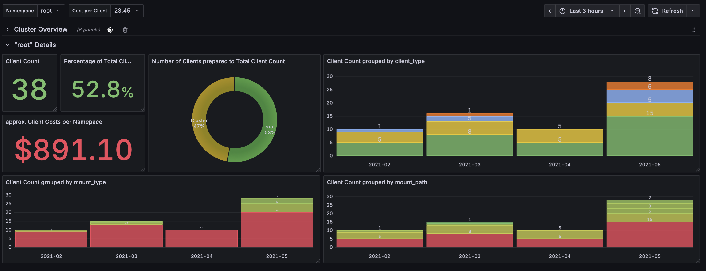

# Vault Client Count Exporter
A dead-simple Prometheus exporter to monitor Vaults Client Count for the entire Cluster and each Namespace.

It uses `sys/internal/counters/activity` (or `sys/internal/counters/activity/monthly` when started with `-monthly`) to fetch the Client Counts of the entire Cluster and every namespace and attributed to every mount_paths.

Read more about these endpoints and how they aggregate the Client count here: https://developer.hashicorp.com/vault/api-docs/system/internal-counters#client-count.

## Requirements
- Vault Version < v1.20
- If your use Vaults Community Edition, you will have to make sure to enable Data Collection (https://developer.hashicorp.com/vault/docs/concepts/billing/clients/client-usage#enable-client-usage-metrics)
- Vault Token Policy that allows `read` on either `sys/internal/counters/activity` and/or `sys/internal/counters/activity/monthly` :

<details>
  <summary>Example Token Policy</summary>

```hcl
path "sys/internal/counters/activity" {
  capabilities = ["read"]
}

path "sys/internal/counters/activity/monthly" {
  capabilities = ["read"]
}
```
</details>


## Example Dashboard
<details>
  <summary>Cluster Overview</summary>



</details>

<details>
  <summary>Namespace Details</summary>



</details>


## Available Metrics
- `vault_client_count_monthly_clients{start_time="<RFC3339>",end_time="<RFC3339>",month="<YYYY-MM>",client_type="<client_type>"}`; Gauge of monthly total client counts reported by Vault
- `vault_client_count_monthly_namespace_clients{start_time="<RFC3339>",end_time="<RFC3339>",month="<YYYY-MM>",namespace="<namespace>",namespace_id="<namespace_id>",namespace_path="<namespace_path>",client_type="<client_type>"}`; Gauge of monthly client counts attributed to a namespace
- `vault_client_count_monthly_mount_clients{start_time="<RFC3339>",end_time="<RFC3339>",month="<YYYY-MM>",namespace="<namespace>",namespace_id="<namespace_id>",namespace_path="<namespace_path>",mount_path="<mount_path>",mount_type="<mount_type>",client_type="<client_type>"}`; Gauge of monthly client counts attributed to a mount
- `vault_client_count_current_namespace_clients{start_time="<RFC3339>",end_time="<RFC3339>",namespace="<namespace>",namespace_id="<namespace_id>",namespace_path="<namespace_path>",client_type="<client_type>"}`; Gauge of current snapshot client counts from `data.by_namespace`
- `vault_client_count_current_mount_clients{start_time="<RFC3339>",end_time="<RFC3339>",namespace="<namespace>",namespace_id="<namespace_id>",namespace_path="<namespace_path>",mount_path="<mount_path>",mount_type="<mount_type>",client_type="<client_type>"}`; Gauge of current snapshot mount counts from `data.by_namespace[].mounts`
- `vault_client_count_activity_period_info{start_time="<RFC3339>",end_time="<RFC3339>"}`; Gauge set to `1` carrying `data.start_time` and `data.end_time` as labels
- `vault_client_count_exporter_version{version="<version>"}`; Gauge set to `1`
- `vault_client_count_refresh_success`; Gauge set to `1` when the last refresh succeeded, otherwise `0`
- `vault_client_count_refresh_timestamp_seconds`; Gauge of the Unix timestamp for the last refresh attempt
- `vault_client_count_refresh_duration_seconds`; Gauge of the last refresh duration in seconds


## Installation
The `vault-client-count-exporter` [publishes binaries/executables](https://github.com/clear-route/vault-client-count-exporter/releases) and [Docker images for `arm64` and `amd64`](https://github.com/orgs/clear-route/packages?repo_name=vault-client-count-exporter).

## Configuration
All of [Vaults Environment Variables](https://developer.hashicorp.com/vault/docs/commands) are supported. You will need at least have to provide `VAULT_ADDR` and `VAULT_TOKEN`.

## Usage
```bash
> vault-client-count-exporter -h
  -address string
        address for metrics HTTP server (default "0.0.0.0")
  -port string
        address for metrics HTTP server (default "9090")
  -refresh-interval duration
        interval between Vault refreshes (default 5m0s)
  -start_time string
        optional RFC3339 or Unix epoch activity query start time
  -end_time string
        optional RFC3339 or Unix epoch activity query end time
  -monthly
        use sys/internal/counters/activity/monthly instead of sys/internal/counters/activity
  -timeout duration
        timeout for each Vault refresh request (default 5s)
```

## Demo
Checkout [./docker/docker-compose.yml](./docker/docker-compose.yml) to find a prepared demo env with Prometheus, Grafana, Vault and the `vault-client-count-exporter` automatically set up:

```bash
> cd docker
> docker compose up
```

You should find Vault on [http://localhost:8200](http://localhost:8200), Grafana on [http://localhost:3000](http://localhost:3000), Prometheus on [http://localhost:9090](http://localhost:9090) and the `vault-client-count-exporter` running on [http://localhost:8090](http://localhost:8090).

The Demo stack is to designed to use [dummy client count data](assets/sample.json). You can disable these by removing the `VAULT_MONTHLY_ACTIVITY_FILE` environment file from [./docker/docker-compose.yml](./docker/docker-compose.yml)

You can find the sample dashboard in [assets/dashboard.json](./assets/dashboard.json).
